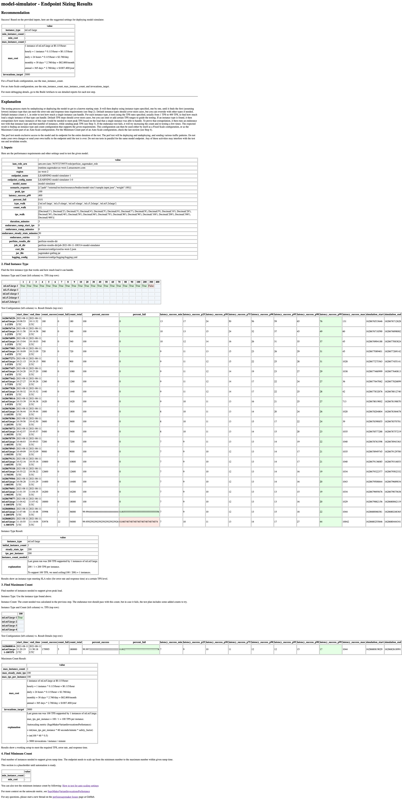
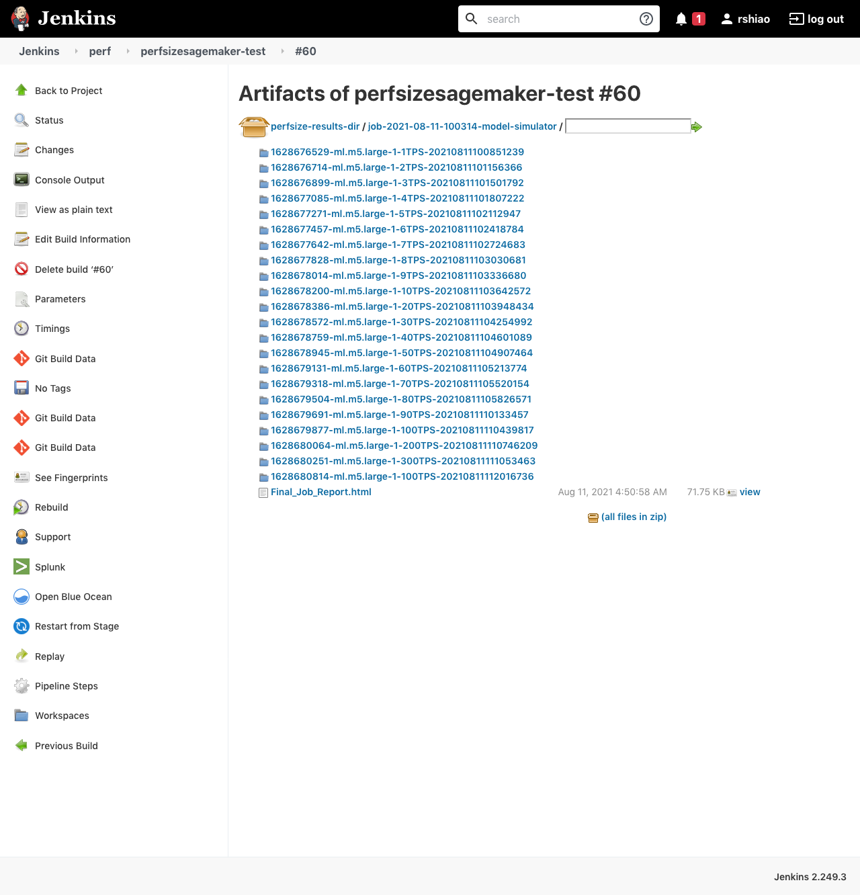
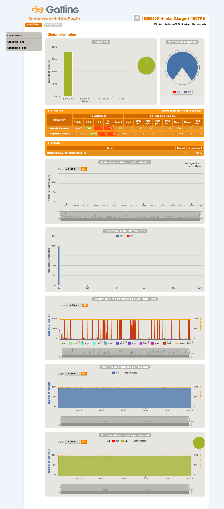

# perfsizesagemaker

[](https://github.com/intuit/perfsizesagemaker/actions/workflows/python-publish.yml)

`perfsizesagemaker` is a tool that uses automated performance testing to determine the right size of
infrastructure for hosting models on AWS SageMaker.

To host models on AWS SageMaker endpoints, model owners need to determine appropriate configuration
settings that are powerful enough to meet requirements but also cost effective. Requirements to
consider include expected peak traffic level (requests per second), allowed response time
(milliseconds), and allowed error rate (failure percentage). The user can provide these
requirements and customize options for the testing strategy.

With these inputs, the `perfsizesagemaker` tool follows a sequence of steps to deploy various
runtime configurations, send test traffic, analyze results, and recommend configurations with cost
estimates.

- To determine what configuration to test next, a
  [step manager](perfsizesagemaker/step/sagemaker.py)
  follows prescribed logic based on results collected so far. The default logic involves trying
  to find the lowest instance type that can work, finding how much traffic one instance can handle,
  and then verifying how many instances would be needed to support overall peak traffic.

- To update the environment, an
  [environment manager](perfsizesagemaker/environment/sagemaker.py)
  uses
  [AWS SDK for Python (Boto3)](https://aws.amazon.com/sdk-for-python/)
  to interact with the designated AWS account and set up each configuration.

- To send traffic, a
  [load manager](perfsizesagemaker/load/sagemaker.py)
  uses
  [sagemaker-gatling](https://github.com/intuit/sagemaker-gatling)
  to call the SageMaker endpoint with the desired traffic level per configuration.

- To gather results, a
  [result manager](https://github.com/intuit/perfsize/blob/main/perfsize/result/gatling.py)
  parses simulation.log files from Gatling to get metrics. In the future, other result managers
  could be added to gather results from other systems like Splunk, Wavefront, CloudWatch, etc.

`perfsizesagemaker` can also serve as a reference implementation for how to use the
[perfsize](https://github.com/intuit/perfsize)
library, which has some interfaces and components that can be reused in other implementations for
sizing other types of infrastructure.

## Installation

`perfsizesagemaker` is published to PyPI

Install using `pip` (or your preferred dependency manager and virtual environment):

```bash
pip install perfsizesagemaker
```

## Usage

### Prerequisites

- Python 3.8+

### Demo

You can run perfsizesagemaker on any SageMaker endpoint in your AWS account.

But the steps in this demo will use
[model-simulator](https://github.com/intuit/model-simulator)
as an example model for setting up a SageMaker endpoint to test.

Follow the steps in the
[model-simulator README](https://github.com/intuit/model-simulator/blob/main/README.md)
to set up the model in your account and check the SageMaker endpoint is working as expected.

Follow the steps in the
[sagemaker-gatling README](https://github.com/intuit/sagemaker-gatling)
to build the `sagemaker-gatling-1.0-SNAPSHOT-fatjar.jar` and save a copy here as
`sagemaker-gatling.jar`. Or, you can also download from the
[sagemaker-gatling package](https://github.com/intuit/sagemaker-gatling/packages/913839)
page.

You can supply AWS credentials as environment variables to access your account:
```
AWS_ACCESS_KEY_ID
AWS_SECRET_ACCESS_KEY
AWS_SESSION_TOKEN
```

See [resources](resources) directory and ensure the following files are available:
- a cost config file like [resources/configs/cost/us-west-2.json](resources/configs/cost/us-west-2.json)
- a logging config file like [resources/configs/logging/logging.yml](resources/configs/logging/logging.yml)

Run the main module with these options:
```
poetry shell

python -m perfsizesagemaker.main \
--host runtime.sagemaker.us-west-2.amazonaws.com \
--region us-west-2 \
--endpoint_name LEARNING-model-simulator-1 \
--endpoint_config_name LEARNING-model-simulator-1-0 \
--model_name model-simulator \
--scenario_requests '[{"path":"samples/model-simulator/sample.input.json","weight":100}]' \
--peak_tps 5 \
--latency_success_p99 500 \
--percent_fail 0.1 \
--type_walk ml.m5.large,ml.m5.xlarge \
--count_walk 1 \
--tps_walk 1,10,100 \
--duration_minutes 1 \
--endurance_ramp_start_tps 0 \
--endurance_ramp_minutes 0 \
--endurance_steady_state_minutes 1 \
--endurance_retries 3 \
--perfsize_results_dir perfsize-results-dir
```

### Sample Jenkinsfile

Another usage option is to use Jenkins to host a job for running perf tests.

In your AWS Account, create a role with permission to deploy, undeploy, and send traffic.
- AWS Console > IAM Management Console > Roles > Create role
- Choose a use case > `SageMaker`. Next.
- Attached permissions policies shows `AmazonSageMakerFullAccess`. Next.
- Role name: `perfsizesagemaker_role`

If other roles (like the role your Jenkins server is using) will need to assume the above role, you
can allow that by:
- IAM > Roles > perfsizesagemaker_role > Trust relationships > Edit trust relationship
- Add an entry for the Jenkins role (where test job is running) to assume the
  perfsizesagemaker_role (where endpoint is running):
```
    {
      "Sid": "",
      "Effect": "Allow",
      "Principal": {
        "AWS": "arn:aws:iam::222222222222:role/your-jenkins-role-name-here"
      },
      "Action": "sts:AssumeRole"
    },
```

See [JenkinsfilePerfTest](JenkinsfilePerfTest) as an example.

### Sample Results

#### Summary Report

Here is a sample
[Final_Job_Report.html](resources/samples/model-simulator/job-2021-08-11-100314-model-simulator/Final_Job_Report.html).
It summarizes test results and recommends a working configuration if one was found.



In this case, the first instance type attempted worked, and it supported up to 200 TPS on a single
instance. Since the required peak was given as only 100 TPS, a single instance was more than enough.

In other cases, if the first instance type attempted failed, then the testing process would try
the next types available. Or, if a single instance only supported, say, 20 TPS, and required peak
was 100 TPS, then the process would extrapolate 100/20 = 5 instances, and run an endurance test to
confirm.

#### Step Details

If there is some unexpected result, you can get more debugging details.

See the artifacts in the output folder (in this case, as run from a Jenkins job):



This folder contains the summary report above along with more detailed reports for each step. The
folders are named by combining the current timestamp and various configuration settings being
tested. This way, each test step should have a unique name, and you can tell the run order and
configuration.

For example, the
[1628680814-ml.m5.large-1-100TPS-20210811112016736](resources/samples/model-simulator/job-2021-08-11-100314-model-simulator/1628680814-ml.m5.large-1-100TPS-20210811112016736/index.html)
was the test run at Unix time `1628680814` with `ml.m5.large` instance type, `1` instance count, at
`100 TPS`.

The folder contains an
[index.html](resources/samples/model-simulator/job-2021-08-11-100314-model-simulator/1628680814-ml.m5.large-1-100TPS-20210811112016736/index.html)
which shows the Gatling report for that step:



Checking the detailed report gives you the breakdown of error codes. In this case, there were 5
errors overall, and they were all status 400.

The report also gives you graphs showing metrics over time. You can check active users, response
time, request rate, and response rate.

With these details, you can investigate more as needed, especially if you find failures at traffic
levels lower than what you were expecting.

### Auto Scaling

- For more context on the auto scale metric, see
  [SageMakerVariantInvocationsPerInstance](resources/docs/auto-scale-metric.md).
- You can also test for the minimum instance count by following
  [How to test for auto scaling settings](resources/docs/auto-scale-testing.md).

### Tests

See [tests](tests) folder for more examples.


## Development

Clone repository:

```
git clone https://github.com/intuit/perfsizesagemaker.git
cd perfsizesagemaker
```

Install `poetry` for dependency management and packaging:
```
https://python-poetry.org/docs/
```

Set up your virtual environment (with package versions from `poetry.lock` file):
```
poetry install
```

Start a shell for your virtual environment for running additional commands that need access to the
installed packages:
```
poetry shell
python anything.py
```

Other commands from the Makefile:
- `make format`: format code with [black](https://github.com/psf/black)
- `make test`: run all tests
- `make build`: create artifacts
- `make publish`: push artifacts to Artifactory

See packages installed:
```
poetry show --tree
```

See info about environments:
```
poetry env info
poetry env list
```

### Integration with your IDE

Optional. For integration with your IDE, you can run `poetry env info` to get the Virtualenv path,
like `/Users/your-name-here/Library/Caches/pypoetry/virtualenvs/perfsizesagemaker-VvRdEPIE-py3.9`, and point your IDE
to the `bin/python` there.

In IntelliJ:
- Create a new Python SDK option under
  `File > Project Structure > Platform Settings > SDKs > Add new Python SDK > Virtualenv Environment > Existing environment > Interpreter`
  and specify the path above including `bin/python`.
- Update `Project Settings > Project SDK` and `Project Settings > Modules > Module SDK` to point to
  the SDK you just created.


## Publishing a Release️

Make sure you are doing this from a clean working directory.

Possible release types are:
- `patch`
- `minor`
- `major`
- `prepatch`
- `preminor`
- `premajor`
- `prerelease`

```bash
VERSION_BUMP_MSG=$(poetry version --no-ansi <release>)
NEW_VERSION=$(poetry version --no-ansi | cut -d ' ' -f2)
git commit -am "${VERSION_BUMP_MSG}"
git tag "v${NEW_VERSION}"
git push && git push --tags
```

Once tag is published as a release, GitHub Action
[python-publish.yml](.github/workflows/python-publish.yml)
will publish the artifacts to
[perfsizesagemaker](https://pypi.org/project/perfsizesagemaker/)
on PyPI.


## Contributing

Feel free to open an
[issue](https://github.com/intuit/perfsizesagemaker/issues)
or
[pull request](https://github.com/intuit/perfsizesagemaker/pulls)!

For major changes, please open an issue first to discuss what you would like to change.

Make sure to read our [code of conduct](CODE_OF_CONDUCT.md).


## License

This project is licensed under the terms of the [Apache License 2.0](LICENSE).
